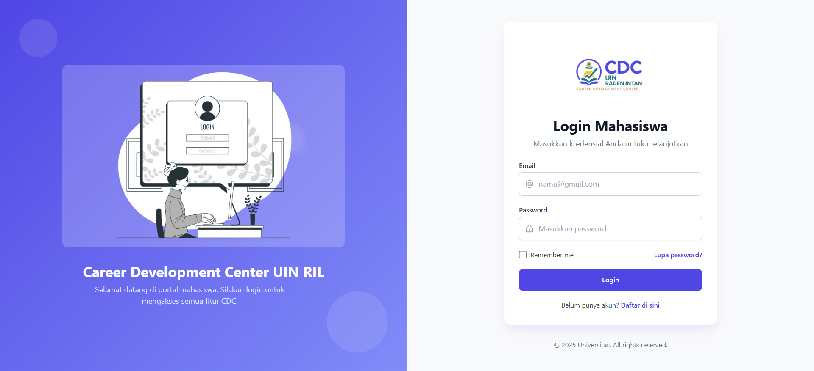
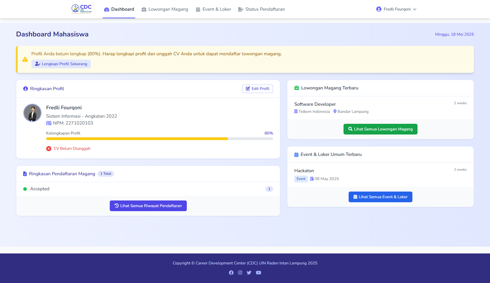
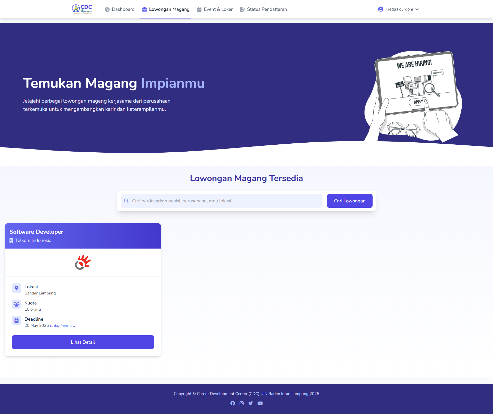
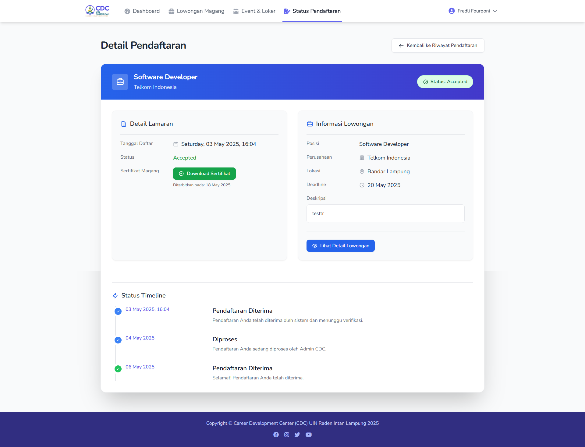
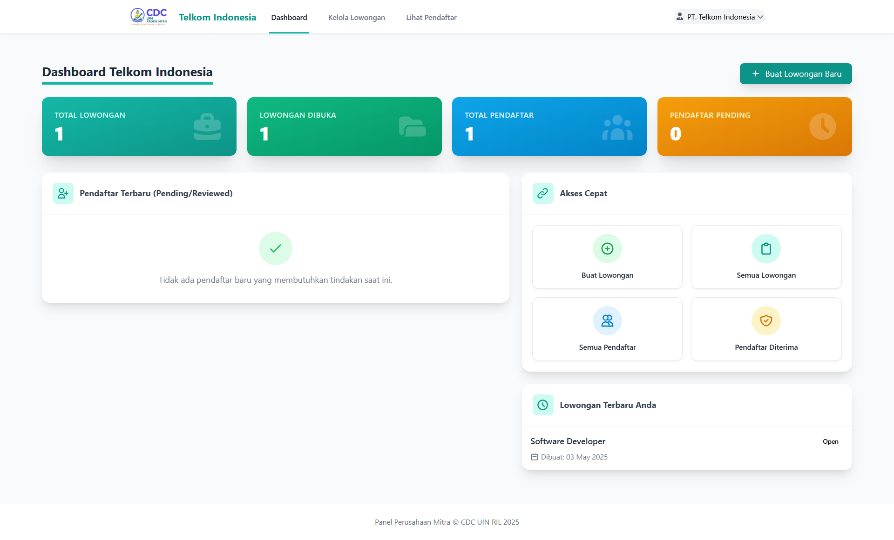

# CDC UIN RIL - Career Development Center

Platform berbasis web Career Development Center (CDC) untuk UIN Raden Intan Lampung, dirancang untuk memfasilitasi mahasiswa dalam mengakses peluang magang, loker umum, serta mengikuti berbagai event karir.

👥 Development Team

The CDC UIN RIL platform was developed by a dedicated team of talented individuals:

- Dosen Pengampu : Wawan Gunawan, M.Ti

- Fredli Fourqoni : 2271020103
- Ekta Pramudya  : 2271020094
- Fillah Ramadani : 2271020102

## Fitur Utama

### Admin (Superuser)
- Dashboard overview (statistik)
- CRUD Akun Perusahaan Mitra
- CRUD Lowongan Kerjasama
- CRUD Event/Loker Umum
- Manajemen Data Mahasiswa & Akun
- Manajemen Status Pendaftaran Mahasiswa
- Upload Sertifikat (oleh perusahaan, diawasi admin)

### Mahasiswa
- Registrasi dan Login
- Lihat Daftar Lowongan Kerjasama & Detail
- Daftar Magang Langsung Melalui Sistem
- Lihat Daftar Event/Loker Umum (redirect link)
- Tracking Status Pendaftaran
- Update Profil Diri, CV, dan Foto Profil
- Download Sertifikat Magang

### Perusahaan Mitra
- Login ke Dashboard Perusahaan
- Membuat, Mengedit, dan Menghapus Lowongan Magang Milik Sendiri
- Melihat Pendaftar di Lowongan Mereka
- Menerima/Menolak Pendaftar Magang
- Mengunggah Sertifikat Magang untuk Mahasiswa

## Teknologi yang Digunakan
- Backend: Laravel 10, PHP 8.1
- Frontend: Tailwind CSS, Vite
- Database: MySQL / MariaDB
- Version Control: Git & GitHub

## Screenshot

Berikut adalah beberapa tampilan dari aplikasi CDC UIN RIL:

**Login Mahasiswa**

**Dashboard Mahasiswa**

**Halaman Lowongan (Mahasiswa)**

**Status Magang generate sertifikat**

**Dashboard Perusahaan**

## Instalasi
1. Clone repositori: `git clone https://github.com/fredli4qooni/cdc_uinril_implementasiSI.git`
2. Masuk ke direktori proyek: `cd cdc_uinril_implementasiSI`
3. Install dependensi PHP: `composer install`
4. Salin file environment: `cp .env.example .env`
5. Generate application key: `php artisan key:generate`
6. Buat database dan konfigurasikan koneksi di file `.env`.
7. Jalankan migrasi dan seeder (jika ada): `php artisan migrate --seed`
8. Install dependensi Node.js: `npm install`
9. Jalankan build aset frontend: `npm run dev` (untuk development) atau `npm run build` (untuk production)
10. Buat symbolic link untuk storage: `php artisan storage:link`
11. Jalankan server development: `php artisan serve`
12. Akses aplikasi di browser Anda (default: `http://127.0.0.1:8000`). Akun admin default (jika ada di seeder): `admin@example.com` / `password`.

## Lisensi
Proyek ini dilisensikan di bawah [MIT License](LICENSE).
